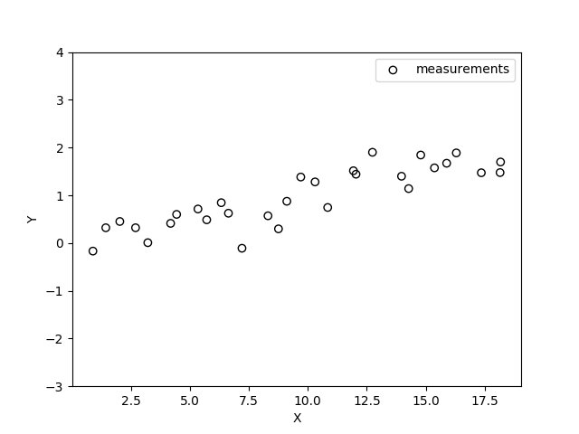
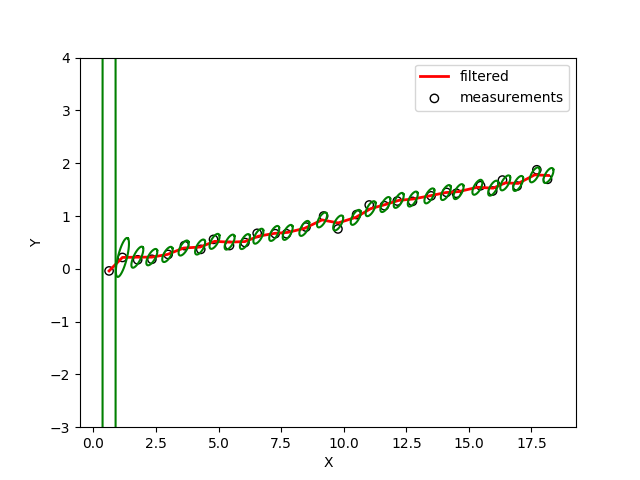

# Kalman Filter

The aim is to track an object based on noisy measurements in 2D. This is achieved using a Kalman Filter.


## Usage
1. Generate data
The sensor reads 2D position of the object. We assume a fixed velocity for the object. The final reading is perturbed with Gaussian noise.
```python
python src/sensor.py
```


2. Filter
```python
python src/simple_filter.py
```

