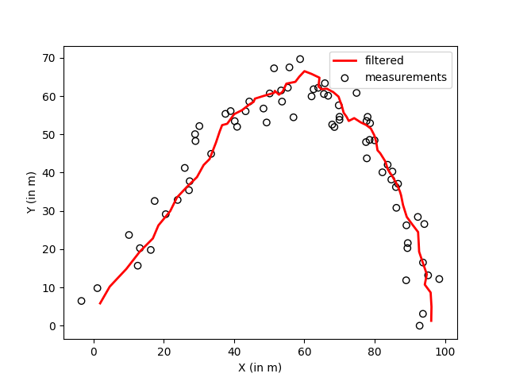

# Kalman Filter

The aim is to track an object based on noisy measurements in 2D. This is achieved using a Kalman Filter.

## 1. Constant Velocity Model
The sensor reads 2D position of the object. We assume a fixed velocity for the object. The final reading is perturbed with Gaussian noise.
```python
python src/constant_velocity_model/filter.py
```


The ellipse indicates 95% confidence interval for the covariance matrix between x and y.


## 2. Constant Acceleration Model
A ball is thrown in vacuum travelling in a parabola under constant gravitational field. The measurements contain position of ball in 2D with Gaussian noise. Here we use the acceleration as a control input in the Kalman Filter.
```python
python src/constant_acceleration_model/filter.py
```

